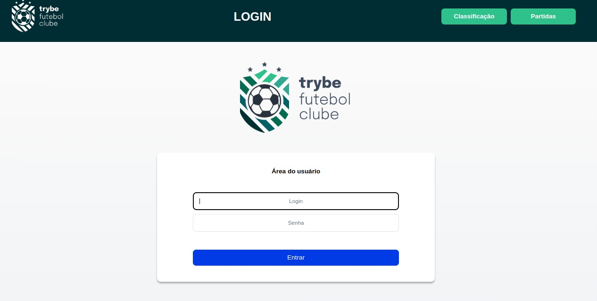

# Boas vindas ao TFC - Trybe Futebol Clube




### :gear: Instalação

1 - Clone o repositório:

```
git clone git@github.com:DeoliveiraJR/TFC-trybe-futebol-clube.git
```

2 - Acesse o projeto e Instale as dependências :

```
cd TFC-trybe-futebol-clube
npm install
```

3 - rode o Docker Compose na raiz do projeto:

```
npm run compose:up
```

4 - Abra o diretorio do frontend e inicialize a aplicação:

```
cd app/frontend
npm start
```

### 🛠️ Tecnologias:

* [TypeScript](https://www.typescriptlang.org/)
* [Node.js](https://nodejs.org/pt-br/docs/)
* [Git](https://git-scm.com/doc)
* [Express](https://expressjs.com/en/starter/installing.html)
* [Docker](https://www.docker.com/)
* [MySQL](https://dev.mysql.com/doc/)
* [Sequelize](https://sequelize.org/docs/v6/getting-started/)


:speaking_head: Criado por [Trybe](https://www.betrybe.com/) e desenvolvido por [DeOliveira JR]()


[](https://www.linkedin.com/in/deoliveirajr/)    [](https://github.com/DeoliveiraJR)
